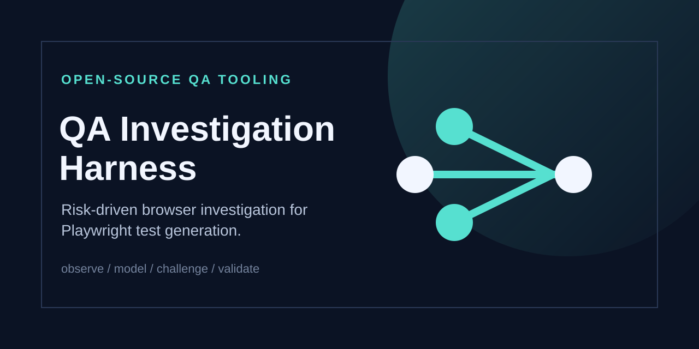
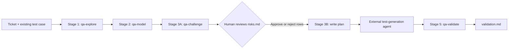

# QA Investigation Harness

> A risk-driven investigation layer for Playwright test generation.



The QA Investigation Harness turns a written test case into an evidence-backed hand-off for a separate Playwright test-generation agent. It walks the real browser flow, models the states and transitions that were observed, puts risks in front of a human for approval, and produces a plan that can be audited after generation.

It is deliberately small and tool-agnostic: the methodology lives in one set of stage instructions, while GitHub Copilot, Claude Code, and Codex use thin adapters around it.

## Why it exists

Test generation is more useful when it starts from what the application actually did and from risks a human has consciously chosen to cover. This harness adds that investigation layer before generation without taking ownership of test code.

The result is a traceable chain:

```text
ticket + test case
        │
        ▼
  browser exploration ──► state/transition model ──► proposed risks
                                                              │
                                                human approves/rejects
                                                              │
                                                              ▼
                                                     generator plan
                                                              │
                                                              ▼
                                                   oracle validation
```

## Core capabilities

- **Snapshot-based exploration** — records the live flow, accessibility-tree elements, URLs, visible changes, and evidence gaps.
- **State and transition modeling** — separates observed transitions from plausible transitions that were not walked.
- **Human-gated risk review** — generates proposed risks; only the human marks them approved or rejected.
- **Generator-compatible output** — writes `specs/<ticket>.plan.md` in a plain plan structure a test-generation agent can consume.
- **Post-generation auditing** — checks generated assertions against approved oracles and can mutation-check assertion strength.

## How the workflow works



The human approval step is intentional. The harness never silently decides which risks matter, and it never writes Playwright test code or seed files.

For the deeper artifact contract and boundaries, see [Architecture](docs/architecture.md).

## Stage outputs

Each flow is identified by the ticket ID supplied by the human:

| Stage | Input | Output |
| --- | --- | --- |
| `qa-explore` | Ticket ID, test case, confirmed non-production URL, interactive test account | `qa-artifacts/<ticket>/exploration.md` |
| `qa-model` | Exploration artifact | `qa-artifacts/<ticket>/flow-model.md` |
| `qa-challenge` Part A | Exploration and flow model | `qa-artifacts/<ticket>/risks.md` with `PROPOSED` rows |
| Human review | Risk table | `APPROVED` / `REJECTED` statuses entered by the human only |
| `qa-challenge` Part B | Approved risks and intact source-date chain | `specs/<ticket>.plan.md` plus generated mapping in `risks.md` |
| External generator | The plan file and the consuming project's test setup | Generated test files in that project |
| `qa-validate` | Mapping, plan, and generated tests | `qa-artifacts/<ticket>/validation.md` |

The `qa-artifacts/` and `specs/` directories are generated workflow output and are intentionally ignored by default. This repository documents and validates the process; it does not publish real investigation findings.

## Tool adapters

The shared methodology lives in [`qa-harness/`](qa-harness/):

- [`RULES.md`](qa-harness/RULES.md) is the source of truth for hard rules, safety boundaries, artifact paths, and stage order.
- [`stages/`](qa-harness/stages/) contains the tool-agnostic instructions for exploration, modeling, challenge, and validation.
- [`.github/prompts/`](.github/prompts/) provides GitHub Copilot prompt adapters.
- [`.claude/skills/`](.claude/skills/) provides Claude Code skill adapters.
- [`AGENTS.md`](AGENTS.md) provides Codex instructions.
- [`CLAUDE.md`](CLAUDE.md) provides Claude Code repository instructions.

Playwright MCP configuration is kept per tool:

- [`.mcp.json`](.mcp.json) is the repository-level MCP configuration used by Claude Code.
- [`.vscode/mcp.json`](.vscode/mcp.json) is the VS Code configuration used by the Copilot setup.
- Codex users can register the server once with the command shown below.

## Getting started

This repository has no application runtime, package manifest, dependency install, Docker image, database, or built-in test suite. There is nothing to build before reading or adapting the harness.

### 1. Clone the repository

```bash
git clone https://github.com/Yasser132456/qa-investigation-harness.git
cd qa-investigation-harness
```

### 2. Choose an adapter

#### GitHub Copilot in VS Code

Open the repository in VS Code. The prompt adapters under `.github/prompts/` and the Playwright MCP configuration under `.vscode/mcp.json` provide the Copilot-facing setup.

#### Claude Code

Open the repository with Claude Code. The root `.mcp.json` registers the Playwright MCP server, and the skills under `.claude/skills/` expose the four harness stages.

#### Codex

Register Playwright MCP once in the global Codex configuration:

```bash
codex mcp add playwright -- npx @playwright/mcp@latest --isolated --caps=core --snapshot-mode=full --timeout-action=30000 --timeout-navigation=30000 --timeout-settle=5000 --test-id-attribute=data-testid
```

Then ask Codex to run a stage by name, supplying the ticket ID and test case where required. The full flow and safety rules are in [`AGENTS.md`](AGENTS.md).

### 3. Run the stages in order

The stage names are the same across adapters:

1. `qa-explore` — provide an existing ticket ID and rough test case; confirm the target is non-production and provide credentials interactively.
2. `qa-model` — build the state/transition model from the exploration artifact.
3. `qa-challenge` — generate proposed risks, then stop for human review.
4. Edit `qa-artifacts/<ticket>/risks.md` by hand and set rows to `APPROVED` or `REJECTED`.
5. Run `qa-challenge` Part B to create the generator plan.
6. Point the consuming project's test-generation agent at `specs/<ticket>.plan.md`.
7. Run `qa-validate` after the generator has produced tests.

### Environment and credentials

The harness requires a non-production target URL and an interactive test account for browser exploration. Credentials are never written to repository files, artifacts, plans, or logs. The confirmed non-production URL may be recorded in the exploration/plan artifacts because the generator needs to know which environment the flow describes.

## What this repository intentionally does not do

- It does not create, edit, or suggest Playwright test code.
- It does not create seed files.
- It does not invent ticket IDs or test cases.
- It does not run against production environments.
- It does not mark risks approved or rejected for the human.
- It does not replace the consuming project's test-generation agent.
- It does not claim API, database, email, background-job, or persisted-state evidence is browser-observable when it is not.

## Repository structure

```text
.
├── .claude/skills/              # Claude Code stage adapters
├── .github/prompts/             # GitHub Copilot stage adapters
├── .vscode/mcp.json             # VS Code Playwright MCP configuration
├── docs/
│   ├── architecture.md          # Detailed workflow and artifact boundaries
│   └── assets/                  # Repository mark and social-preview artwork
├── qa-harness/
│   ├── RULES.md                 # Shared rules and artifact contract
│   ├── README.md                # Multi-tool usage guide
│   └── stages/                  # Explore, model, challenge, validate
├── AGENTS.md                    # Codex repository instructions
├── CLAUDE.md                    # Claude Code repository instructions
├── CONTRIBUTING.md              # Contribution workflow
├── SECURITY.md                  # Security reporting and secret handling
└── README.md
```

## Engineering decisions

### One source of truth, thin adapters

Rules and stage behavior are centralized in `qa-harness/`. Tool-specific files only provide the invocation shape and arguments for their host environment. This keeps methodology changes consistent across adapters.

### Evidence before recommendation

Stage 1 records observations only. Stage 2 models what was observed and what was not. Stage 3 proposes risks without approving them. Keeping these responsibilities separate makes the human review boundary visible and preserves traceability.

### Real oracles, even when the browser cannot verify them

The harness names the oracle that would actually prove a risk, including API or database checks that are not currently wired into the consuming test project. It records that gap instead of replacing the oracle with a weaker rendered-text assertion.

## Development and contribution

Changes to shared rules affect every adapter, so start with [`CONTRIBUTING.md`](CONTRIBUTING.md) and read [`qa-harness/RULES.md`](qa-harness/RULES.md) before editing stage instructions. Security concerns and accidentally exposed credentials belong in [`SECURITY.md`](SECURITY.md).

## Roadmap and known limits

The current repository is intentionally focused on the investigation layer. Potential future work includes additional tool adapters, automated documentation checks, and optional API/database oracle integrations for consuming projects. None of these are implemented here today.

## License

This project is available under the [MIT License](LICENSE).

## GitHub metadata recommendations

The available repository connector can inspect GitHub metadata but cannot update the repository description, topics, or social-preview setting from this environment. Recommended values:

- **Description:** Risk-driven browser-flow investigation and human-reviewed test plans for Playwright test generation.
- **Topics:** `playwright`, `test-automation`, `qa-engineering`, `software-testing`, `browser-automation`, `risk-based-testing`, `test-planning`, `developer-tools`, `llm-agents`, `claude-code`, `github-copilot`.
- **Social preview asset:** [`docs/assets/qa-investigation-harness-social.svg`](docs/assets/qa-investigation-harness-social.svg), upload manually under GitHub repository settings → Social preview.
- **Homepage/demo URL:** None verified; leave unset until a live documentation or demo site exists.
