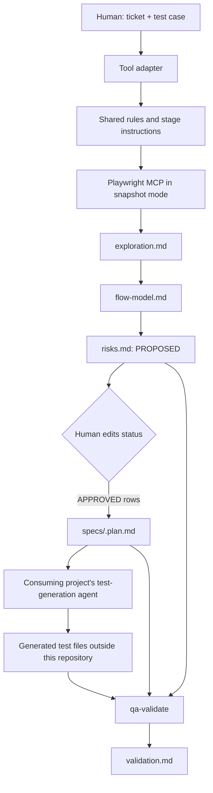

# Architecture

The QA Investigation Harness is a documentation-and-prompt workflow that sits before a consuming project's Playwright test-generation agent. It separates browser observation, modeling, risk review, plan generation, and post-generation validation so that each stage has a clear owner and artifact.

## System boundary

The boundary around the consuming project matters: this repository does not own the application's runtime, test account, seed data, generated specs, API client, database, or CI pipeline. It produces and audits documentation artifacts that another project can use.

## Source-of-truth hierarchy

| Layer | Location | Responsibility |
| --- | --- | --- |
| Shared rules | [`qa-harness/RULES.md`](../qa-harness/RULES.md) | Hard constraints, stage order, safety boundaries, artifact paths, and hand-off rules |
| Stage instructions | [`qa-harness/stages/`](../qa-harness/stages/) | Tool-agnostic behavior for explore, model, challenge, and validate |
| GitHub Copilot adapters | [`../.github/prompts/`](../.github/prompts/) | Prompt shape and arguments for VS Code/Copilot |
| Claude Code adapters | [`../.claude/skills/`](../.claude/skills/) | Skill metadata and argument forwarding |
| Codex guidance | [`../AGENTS.md`](../AGENTS.md) | Plain-language invocation and MCP setup guidance |
| Claude Code guidance | [`../CLAUDE.md`](../CLAUDE.md) | Repository-level stage invocation guidance |

Changes to the shared rules or stage files affect every adapter. Adapter files should remain thin and should not duplicate methodology.

## Stage boundaries

### Stage 1: explore

`qa-explore` walks one test case once through a confirmed non-production environment using Playwright MCP snapshot mode. It records only observations: the action, accessibility-tree element, URL changes, visible changes, omitted observations, missing observations, browser-invisible facts, and candidate seed files that already exist in the consuming project.

It does not propose risks, create seeds, or write test code.

### Stage 2: model

`qa-model` reads `exploration.md` and turns it into states, transitions, inputs/outputs, dependencies, and an explicit list of unobserved transitions. It must not promote an inference to an observed fact and must preserve “unknown” for persisted results the browser could not verify.

### Stage 3: challenge

`qa-challenge` asks what could fail at each state and transition, what the test case assumes, what would actually prove success, and whether that oracle is browser-observable. Part A writes only `PROPOSED` rows. The human owns the `APPROVED`/`REJECTED` decision. Part B runs only after approval and writes one plan entry per approved risk.

### External generation hand-off

The plan is intentionally written as normal test-plan prose. A separate test-generation agent in the consuming project owns Playwright code and seed files. The harness does not invoke that agent or rewrite its output.

### Stage 5: validate

`qa-validate` follows the generated mapping from risk ID to test-case ID and file, compares the generated assertion with the approved oracle, and records conformance findings. Its mutation mode temporarily changes an expected value, reruns the test, and restores the original immediately. It reports raw output and weak assertions; it does not repair generated tests.

## Artifact chain

| Artifact | Owner | Built from | Purpose |
| --- | --- | --- | --- |
| `qa-artifacts/<ticket>/exploration.md` | `qa-explore` | Ticket, test case, live non-production flow | Factual browser observations |
| `qa-artifacts/<ticket>/flow-model.md` | `qa-model` | `exploration.md` | State/transition model and unobserved transitions |
| `qa-artifacts/<ticket>/risks.md` | `qa-challenge` Part A and human | `flow-model.md` | Proposed risks, real oracles, observability, and human status |
| `specs/<ticket>.plan.md` | `qa-challenge` Part B | Approved rows plus source-date chain | Generator-readable plan, without harness-internal risk metadata |
| Generated test files | Consuming project's generator | Plan and consuming project setup | Playwright code outside this repository |
| `qa-artifacts/<ticket>/validation.md` | `qa-validate` | Mapping, plan, generated tests, raw runs | Oracle conformance and mutation findings |

Dates recorded in each artifact let later stages detect stale upstream observations. Existing `TC-<NN>` entries are append-only when a plan is extended.

## Safety boundaries

- Exploration is non-production only.
- Credentials are interactive inputs and are never written to any repository file.
- The confirmed non-production URL may be recorded because it is part of the plan context.
- The harness never marks risks approved or rejected.
- Browser-rendered confirmation is not treated as proof of persistence, email delivery, background processing, or other non-observable effects.
- Snapshot mode is the default; vision or coordinate interaction is not used unless the accessibility tree is genuinely empty and that fact is stated.
- One flow is handled per session so artifacts remain attributable to one ticket and test case.

## Why the boundaries are useful

The design keeps evidence collection separate from judgment. A reviewer can inspect what the browser showed, compare it with the model, approve only the risks worth covering, and later trace each generated assertion back to the approved oracle. Tool adapters can change without changing that contract.

